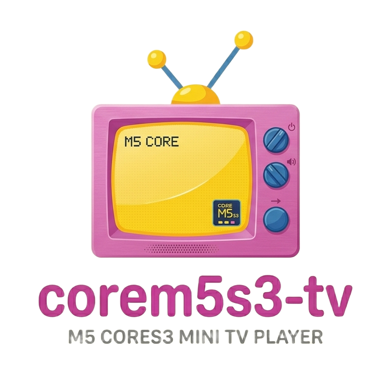

# CoreM5S3 TV



Turn your ESP32-S3-based board into a standalone retro TV that plays episodes with a CRT-like experience. No menus, no navigation — just power on and watch.

## Supported Hardware

### M5Stack CoreS3 SE
- **Display:** 2.0" IPS 320×240 ILI9342C (SPI)
- **Audio:** AW88298 I2S amp + 1 W speaker
- **SD:** SPI mode (CS=4, MOSI=37, MISO=35, SCK=36)

### Waveshare ESP32-S3-Touch-LCD-1.54
- **Display:** 1.54" IPS 240×240 ST7789V2 (SPI)
- **Audio:** ES8311 DAC + NS4150B amp (3W mono)
- **SD:** SD_MMC 4-bit mode (CLK=16, CMD=15, D0=17, D1=18, D2=13, D3=14)
- **Touch:** CST816T capacitive (GPIO42/41 I2C)
- **Buttons:** BOOT/- (GPIO0), PWR (GPIO5), +/Key (GPIO4)

## Quick Start

```bash
# 1. Convert episodes (for Waveshare use --width 240 --height 240)
python3 tools/convert_episodes.py --input ~/Videos/Simpsons --output /Volumes/SDCARD --width 240 --height 240

# 2. Build and flash firmware (select your board)
cd firmware
pio run -e waveshare-s3-touch-lcd-154 --target upload   # Waveshare
pio run -e m5stack-cores3-se --target upload              # M5Stack CoreS3 SE

# 3. Insert SD card, power on
```

## How It Works

```
Video file (.mp4/.mkv)
         │
         ├── ffmpeg ──► .mjpeg (sequential JPEG frames with size prefix)
         │
         └── ffmpeg ──► .pcm (raw 16-bit mono PCM audio)
                                  │
SD Card ──► ESP32-S3 ──► MJPEG decode (JPEGDEC lib)
                            ├── Apply CRT effects (scanlines, noise)
                            ├── Push to display @ 240×240 or 320×240 (SPI)
                            └── Audio sync via I2S → speaker
```

### File Format

**`.mjpeg`** — Custom format: `[4-byte frame size][JPEG data]...` repeated. No header, no index — just sequential frames until EOF.

**`.pcm`** — Raw PCM: 44,100 Hz, 16-bit signed, mono, little-endian. No header.

### Pipeline

| Step | Time (approx) | Core |
|------|---------------|------|
| Read JPEG from SD (SPI) | ~2 ms | 1 |
| Decode JPEG (JPEGDEC) | ~55 ms | 1 |
| Push to display (SPI) | ~5 ms | 1 |
| I2S audio DMA | 0 ms (background) | 0 |
| **Total per frame** | **~62 ms** | |
| **Sustained FPS** | **15** | |

## Storage Estimates

| Item | Per 22-min episode (320×240) | Per 22-min episode (240×240) |
|------|-------------------|-------------------|
| Video (15 FPS, Q8 MJPEG) | ~350 MB | ~200 MB |
| Audio (44.1 kHz, 16-bit, mono PCM) | ~116 MB | ~116 MB |
| **Total** | **~466 MB** | **~316 MB** |

| SD card size | Episodes (320×240) | Episodes (240×240) |
|-------------|-------------------|-------------------|
| 16 GB | ~34 | ~51 |
| 32 GB | ~68 | ~103 |
| 64 GB | ~137 | ~207 |
| 128 GB | ~275+ | ~415+ |

## Firmware

### Prerequisites

- [PlatformIO](https://platformio.org/) (`pip install platformio`)
- Python 3.7+
- ffmpeg (`brew install ffmpeg`)

### Build & Flash

```bash
cd firmware
pio run              # Build only
pio run --target upload   # Build + upload via USB
pio run --target monitor  # Serial monitor (115200 baud)
```

### First Boot

1. Format microSD card as **FAT32** (MBR, not GPT)
2. Copy `.mjpeg` and `.pcm` files to the **root** of the SD card
3. Insert the SD card into your board
4. Connect USB-C, flash firmware (`pio run -e <env> --target upload`)
5. Device reboots into TV mode automatically

No SD card? The display shows "NO SD CARD". No `.mjpeg` files? It shows "NO .mjpeg FILES ON SD CARD".

### Behavior

- **Power on** → Boot animation → TV static → Episode starts
- **Between episodes** → TV static for 2 seconds → next episode
- **Channel OSD** → "CH XX" in top-right corner for 2 seconds per episode
- **Episode order** → Random shuffle on each boot
- **Loop** → Plays continuously until power-off
- **Previous episode** → Touch left side or press - button (Waveshare)
- **Power off** → Hold PWR button 3 seconds → CRT off animation → deep sleep

### Gesture Controls (Waveshare)

- **Vertical swipe** → Volume up/down with OSD indicator
- **Horizontal swipe** → Brightness up/down with OSD indicator
- **Tap** → Previous episode

### Battery Monitoring (Waveshare)

- Shows battery level OSD at episode start
- Low battery warning at 10% with persistent OSD
- Monitors charge status via GPIO

### CRT Effects

- **Scanlines**: Every other row dimmed by 25% — classic CRT look
- **Noise**: Random pixel noise at low opacity
- **TV Static**: Full random grayscale between episodes
- **Power-off animation**: CRT-style collapse effect (700ms)

## Conversion Tool

### Basic usage

```bash
# Convert a directory of episode files
python3 tools/convert_episodes.py -i ~/Videos/Simpsons -o /Volumes/SDCARD

# Convert a single file
python3 tools/convert_episodes.py -s "The.Simpsons.S03E01.mkv" -o ./output

# Custom quality settings
python3 tools/convert_episodes.py -i ./videos -o ./output --fps 15 --quality 10

# Estimate storage without converting
python3 tools/convert_episodes.py -i ./videos --dry-run
```

### Filename Recognition

The tool automatically extracts season/episode numbers from filenames:

- `S01E01` / `s01e01` → `S01E01`
- `1x01` → `S01E01`
- `Season.1.Episode.1` → `S01E01`
- Unrecognized → `EPISODE_001`

### Options

| Flag | Default | Description |
|------|---------|-------------|
| `--input` / `-i` | — | Input directory |
| `--single` / `-s` | — | Single video file |
| `--output` / `-o` | `./output` | Output directory |
| `--fps` | 15 | Target frames per second |
| `--quality` / `-q` | 8 | JPEG quality (1–31, lower = better quality, larger files) |
| `--width` | 320 | Output width in pixels |
| `--height` | 240 | Output height in pixels |
| `--audio-rate` | 44100 | Audio sample rate in Hz |
| `--dry-run` / `-n` | false | Estimate only, don't convert |
| `--start-index` | 0 | Starting index for unnamed files |

### Tuning Guide

The most important parameters for playback quality vs. storage:

- **FPS**: 15 is the target. The decoder sustains ~16–18 FPS.
- **Quality**: 8 is a good balance. 5 is near-transparent (larger files). 12+ starts to show artifacts.
- **Resolution**: 320×240 for M5Stack, 240×240 for Waveshare. Don't change unless you're sure.
- **Audio rate**: 44100 Hz gives good fidelity. 22050 Hz saves ~50% audio space.

## Project Structure

```
CoreM5S3-TV/
├── FEASIBILITY.md                 # Hardware analysis and feasibility
├── README.md                      # This file
├── firmware/                      # PlatformIO firmware project
│   ├── platformio.ini             # Build configuration
│   └── src/
│       ├── main.cpp               # Entry point, TV loop, UI
│       ├── config.h               # All tunable parameters
│       ├── video_player.h/.cpp    # MJPEG decoder + display pipeline
│       ├── audio_player.h/.cpp    # I2S audio playback
│       ├── audio_hal.h            # Hardware abstraction layer
│       ├── display_hal.h          # Display abstraction layer
│       ├── crt_effects.h/.cpp     # Scanlines, noise, static, power-off
│       ├── backlight.h/.cpp       # PWM backlight control
│       ├── battery_monitor.h      # Battery voltage/percentage monitoring
│       ├── gesture_control.h/.cpp # Touch gesture volume/brightness
│       ├── es8311.h/.cpp          # ES8311 DAC driver (Waveshare)
│       ├── logo_240.h             # Boot logo for 240x240 displays
│       └── logo_320.h             # Boot logo for 320x240 displays
├── tools/
│   └── convert_episodes.py        # Episode conversion script
└── sd_card/
    └── README.md                  # SD card preparation guide
```

## Memory Map

```
PSRAM (8 MB total):
├── JPEG decode buffer         64 KB
├── RGB565 framebuffer        154 KB
├── JPEGDEC work buffer        ~8 KB
├── SD read buffer              4 KB
├── I2S DMA buffers             ~8 KB
├── CRT effect scratch          ~4 KB
├── Boot logo data              ~20 KB
├── Remaining for stack/etc.  ~7.4 MB
└── Audio data buffer           2 KB

Internal SRAM (512 KB):
├── FreeRTOS kernel + tasks   ~200 KB
├── Arduino core               ~100 KB
├── WiFi/LWIP stack            ~60 KB
├── M5GFX + M5Unified         ~50 KB
├── Remaining for stack       ~100 KB
```

## Performance

| Resolution | FPS | Quality | CPU Core 0 | CPU Core 1 |
|-----------|-----|---------|-----------|-----------|
| 320×240 | 15 | 8 | ~5% (audio) | ~90% |
| 240×240 | 15 | 8 | ~5% (audio) | ~70% |

## Stretch Goals

- [x] Random episode mode (✓ — default behavior)
- [x] Channel up/down (touch or hardware buttons — needs wiring)
- [ ] 1990s TV UI with OSD menus
- [x] Simpsons intro boot animation (✓ — basic animation present)
- [x] Volume control (via touch gestures on Waveshare)
- [ ] Sleep timer
- [ ] Favorites list
- [x] Shuffle mode (✓ — default)
- [x] Support for Futurama + other shows
- [ ] WiFi streaming from NAS/Jellyfin
- [ ] OTA firmware updates
- [x] Battery monitoring with low-battery alerts
- [x] CRT power-off animation
- [x] Brightness control (via touch gestures)
- [x] Previous episode navigation

## Troubleshooting

**"NO SD CARD" on boot:**
- Check SD card is FAT32 formatted
- Try a different SD card (Class 10 recommended)
- Re-insert the card firmly

**"NO .mjpeg FILES" on boot:**
- Run the conversion tool
- Copy files to SD card root (not in a subfolder)
- Check file extensions are lowercase `.mjpeg`

**Video stuttering:**
- Lower FPS to 15 in config.h or conversion settings
- Increase JPEG quality value (e.g., 10 → 12 = smaller frames)
- Use a faster SD card (Class 10 / U1)

**No audio:**
- Audio must be in a separate `.pcm` file with matching base name
- Check audio is 22050 Hz, 16-bit, mono
- Hardware may need the I2S pins verified (see config.h)

**Audio quality issues (Waveshare):**
- The ES8311 DAC needs I2S MCLK — ensure MCLK pin (GPIO8) is enabled
- Check that `Speaker.startClocks()` runs before ES8311 I2C access

**Display corruption (M5Stack only):**
- The SD card and display share SPI bus and GPIO35 — this is normal
- M5GFX handles the pin sharing, but if you see corruption, try lowering SD_SPI_FREQ in config.h

**Touch not responding (Waveshare):**
- Check TOUCH_RST (GPIO47) and TOUCH_INT (GPIO48) are properly connected
- Run I2C scan at boot to verify CST816T at address 0x15
- Ensure touch controller boots after reset release (50ms delay)

**Battery OSD not showing:**
- Battery monitoring only works on Waveshare with hardware
- Check BAT_ADC (GPIO1) and BAT_CHG_STAT (GPIO3) connections
- Battery percentage uses LiPo curve (3.0V=0%, 4.2V=100%)

**Gesture controls not working:**
- Ensure touch is working first (see above)
- Check GESTURE_DEBUG in config.h for detailed logging
- Minimum swipe distance is 15px, tap duration 300ms
